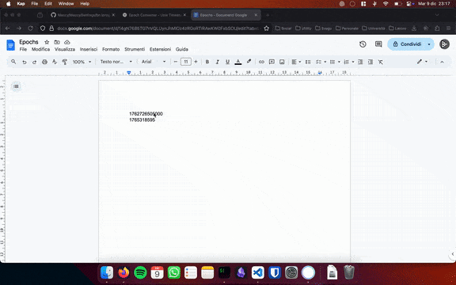

<table>
<tr>
<td></td>
<td><h1>Simple Epoch Converter</h1></td>
</tr>
</table>


A simple and fast macOS menu bar application to convert epoch timestamps to human-readable dates.

## ✨ Features

- **Instant Conversion**: Select an epoch timestamp anywhere on your Mac and press the global shortcut
- **Customizable Shortcut**: Default <kbd>⌘</kbd> + <kbd>⇧</kbd> + <kbd>E</kbd> (customizable from settings)
- **Multiple Formats**: Handles both seconds and milliseconds timestamps
- **Relative Time**: Shows how long ago or until the date ("3 days ago", "in 2 hours")
- **Menu Bar Icon**: Custom spiral icon in the menu bar for quick access
- **SwiftUI Interface**: Modern, native macOS popover interface
- **Easy Copy**: Copy both epoch and converted date with a single click
- **Settings Menu**: Customize shortcuts and enable launch at login
- **Launch at Login**: Optional automatic startup with macOS

## 🚀 Usage



### First Time Setup

1. Grant accessibility permissions when prompted:
   - Go to **System Settings** → **Privacy & Security** → **Accessibility**
   - Add **SimpleEpochConverter** to the authorized apps list

The app will show a detailed alert with instructions if permissions are needed.

### Converting Timestamps

1. **Select** an epoch timestamp in any app (browser, terminal, text editor, etc.)
2. **Press** your configured shortcut (default: <kbd>⌘</kbd> + <kbd>⇧</kbd> + <kbd>E</kbd>)
3. **View** the converted date in the popover window

Alternatively, click the menu bar icon to view the last conversion.

### Customizing Settings

Right-click the menu bar icon to access:
- **Settings**: Configure custom shortcuts and launch at login
- **Quit**: Close the application

### Examples

- **Seconds**: `1733184000` → December 3, 2024 at 01:00:00 CET
- **Milliseconds**: `1733184000000` → December 3, 2024 at 01:00:00 CET
- **In text**: "timestamp: 1733184000" → Automatically extracts the number

## 🛠️ Installation

### Option A: Install with Homebrew (Recommended)

```bash
# Add the tap
brew tap allebedo/tap

# Install the app
brew install --cask simple-epoch-converter
```

The app will be automatically installed to `/Applications` and quarantine attributes will be removed.

### Option B: Download from Releases

1. Download the latest `.zip` from [GitHub Releases](https://github.com/AlleBedo/SimpleEpochConverter/releases)
2. Extract and move `SimpleEpochConverter.app` to `/Applications`
3. Remove quarantine: `xattr -cr /Applications/SimpleEpochConverter.app`
4. Launch the app

### Option C: Build from Source

See [DEVELOP.md](DEVELOP.md) for detailed build instructions.

## 🔐 Permissions

The app requires **Accessibility** permissions to:
- Read selected text when using the global shortcut
- Simulate <kbd>⌘</kbd> + <kbd>C</kbd> to copy selected text

These permissions are only needed for the global shortcut functionality. The app will request them automatically on first launch with detailed instructions.

### Security Note

Without code signing, macOS may show a security warning on first launch:

1. Go to **System Settings** → **Privacy & Security**
2. Click **"Open Anyway"** next to the SimpleEpochConverter message
3. Confirm by clicking **"Open"**

When installed via Homebrew, the quarantine attribute is automatically removed.

## 🐛 Troubleshooting

### The shortcut doesn't work

1. Check that you've granted Accessibility permissions in System Settings
2. Make sure text is selected before pressing the shortcut
3. Verify no other app is using the same shortcut
4. Try changing the shortcut from the app's settings menu

### "Cannot verify that SimpleEpochConverter is free from malware"

Run this command to remove the quarantine attribute:
```bash
xattr -cr /Applications/SimpleEpochConverter.app
```

Or install via Homebrew, which handles this automatically.

### App doesn't appear in Spotlight

The app should be visible in Spotlight. If not:
1. Check that the app is in `/Applications/`
2. Try rebuilding Spotlight index: `sudo mdutil -E /`

For more troubleshooting and development instructions, see [DEVELOP.md](DEVELOP.md).

## 🤝 Contributing

Contributions are welcome! Please:

1. Fork the repository
2. Create a feature branch (`git checkout -b feature/amazing-feature`)
3. Commit your changes (`git commit -m 'Add amazing feature'`)
4. Push to the branch (`git push origin feature/amazing-feature`)
5. Open a Pull Request

For development setup and guidelines, see [DEVELOP.md](DEVELOP.md).

## 📄 License

This project is licensed under the MIT License - see the [LICENSE](LICENSE) file for details.

## 💡 Tips

- **Quick access**: Keep the app running in the background and use the shortcut anytime
- **Batch conversion**: The app remembers your last conversion, accessible via the menu bar
- **Development workflow**: Perfect for debugging timestamp issues in logs and databases
- **Time zones**: All conversions respect your system's timezone settings
- **Custom shortcuts**: Configure your preferred key combination from the settings menu
- **Launch at login**: Enable in settings to have the app ready when you start your Mac

---

**Made with ❤️ for developers who work with timestamps**

For support or questions, please open an issue on [GitHub](https://github.com/AlleBedo/SimpleEpochConverter/issues).
